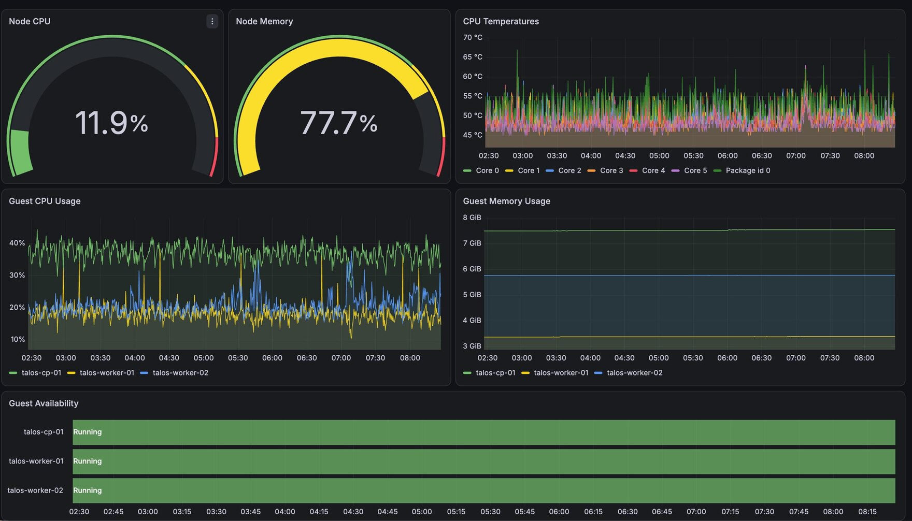
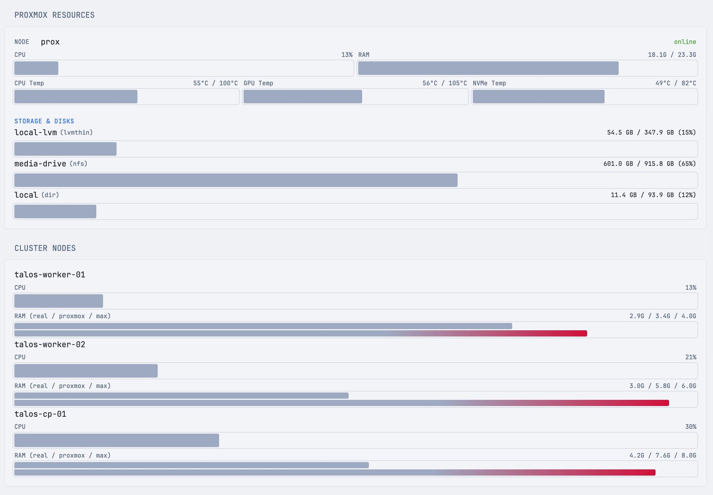

# pve-metrics-exporter

A small Proxmox VE exporter with two outputs from one shared data fetch:

- **`/metrics`** — a real Prometheus exporter (via `client_golang`), covering node/VM/LXC/storage resource usage *and* hardware sensor temperatures (CPU, GPU, NVMe, chipset, etc. — whatever `lm-sensors` reports on the host). Most Proxmox exporters skip temperatures entirely; this one doesn't.
- **`/api/summary`** — the same data as flat, pre-computed JSON (percentages already done, sensor labels already parsed), meant for dashboards like [Glance](https://github.com/glanceapp/glance) that want to render values directly without embedding data-munging logic in a template.

Both are served from one shared, short-TTL cache, so polling both concurrently doesn't double the load on your Proxmox API.

## Dashboards

`/metrics` in Grafana (left); `/api/summary` rendered directly by [Glance](https://github.com/glanceapp/glance) (right):

<p>
  
  
</p>

## Why

Proxmox's `sensorsOutput` field (from `/nodes/{node}/status`) embeds the raw `sensors -j` (lm-sensors) output as a JSON-encoded *string*, not a nested object — most tools that consume the Proxmox API skip it because of that extra parsing step. This exporter does the parsing once, server-side, and exposes clean values either way you want them.

## Running it

```bash
docker run -d \
  -p 9221:9221 \
  -e PROXMOX_URL=https://your-proxmox-host:8006 \
  -e PROXMOX_TOKEN='PVEAPIToken=user@pve!tokenid=uuid' \
  ghcr.io/drumandbytes/pve-metrics-exporter:latest
```

Then:

```bash
curl http://localhost:9221/api/summary
curl http://localhost:9221/metrics
```

### Proxmox API token

Create one in the Proxmox web UI under *Datacenter → Permissions → API Tokens*. The token needs read access to `/`, `/nodes`, and whatever storage/VM paths you want reflected (`PVEAuditor` role is enough — this exporter never writes anything). Uncheck "Privilege Separation" only if you want the token to inherit the user's full permissions instead of managing them separately.

`PROXMOX_TOKEN` is the full `Authorization` header value, e.g. `PVEAPIToken=user@pve!tokenid=uuid-secret-here`.

## Configuration

All configuration is via environment variables:

| Variable | Default | Description |
|---|---|---|
| `PROXMOX_URL` | *(required)* | Base URL of the Proxmox API, e.g. `https://192.168.1.10:8006` |
| `PROXMOX_TOKEN` | *(required)* | Full `Authorization` header value (see above) |
| `PROXMOX_INSECURE_SKIP_VERIFY` | `true` | Skip TLS certificate verification. Proxmox ships a self-signed cert by default; set to `false` once you've replaced it with one from a trusted CA. |
| `PROXMOX_REQUEST_TIMEOUT` | `10s` | Timeout for each request to the Proxmox API |
| `LISTEN_ADDR` | `:9221` | Address/port the exporter listens on |
| `CACHE_TTL` | `15s` | How long a fetched result is reused before hitting the Proxmox API again |
| `CACHE_MAX_STALE` | `5m` | If a refresh fails, how long a previously-cached result keeps being served before the error is surfaced instead |
| `TEMPERATURE_UNIT` | `celsius` | `celsius` or `fahrenheit` — affects **`/api/summary` only**. See below. |

### Why isn't `TEMPERATURE_UNIT` global?

Prometheus convention bakes the unit into the metric name itself (see `node_exporter`'s `node_hwmon_temp_celsius`), specifically so a dashboard or alert built against that name never has to guess what unit it holds. Toggling it via an env var would mean either lying about the metric's name or renaming it out from under someone's saved panel the moment they flip the setting. So `/metrics` always exposes **both** `pve_node_temperature_celsius` and `pve_node_temperature_fahrenheit`, unconditionally, side by side — nothing to configure, nothing that can break. `TEMPERATURE_UNIT` only affects the convenience fields in `/api/summary`'s JSON, which is meant for direct human-facing display (e.g. a Glance widget), where a single configured unit is exactly what you want.

## `/api/summary` response shape

```json
{
  "generated_at": "2026-08-29T10:48:53Z",
  "temperature_unit": "celsius",
  "nodes": [
    {
      "name": "prox",
      "status": "online",
      "cpu_percent": 12.6,
      "mem_used_bytes": 18397749248,
      "mem_total_bytes": 25064054784,
      "mem_percent": 73.4,
      "disk_used_bytes": 12235657216,
      "disk_total_bytes": 100861726720,
      "disk_percent": 12.1,
      "temperatures": [
        { "kind": "cpu", "chip": "coretemp-isa-0000", "label": "Package id 0", "value": 50, "critical": 100, "critical_percent": 50 }
      ],
      "cpu_temp": { "kind": "cpu", "chip": "coretemp-isa-0000", "label": "Package id 0", "value": 50, "critical": 100, "critical_percent": 50 },
      "gpu_temp": { "kind": "gpu", "chip": "nouveau-pci-0100", "label": "temp1", "value": 55, "critical": 105, "critical_percent": 52.4 },
      "nvme_temp": { "kind": "nvme", "chip": "nvme-pci-0200", "label": "Composite", "value": 48.85, "critical": 81.85, "critical_percent": 59.7 }
    }
  ],
  "vms": [ { "type": "qemu", "node": "prox", "name": "...", "vmid": 100, "status": "running", "cpu_percent": 14, "mem_used_bytes": 0, "mem_total_bytes": 0, "mem_percent": 0 } ],
  "lxcs": [],
  "storages": [ { "node": "prox", "name": "local-lvm", "plugin_type": "lvmthin", "used_bytes": 0, "total_bytes": 0, "percent": 12.3 } ]
}
```

`cpu_temp`/`gpu_temp`/`nvme_temp` are best-effort convenience picks out of `temperatures` (the full list is always included too) — the same object shape either way. They're `null` when nothing matching was found — e.g. a node with no `lm-sensors` configured, or no discrete GPU.

`critical`/`critical_percent` are omitted (not present, not `null`) when the sensor chip doesn't report a usable threshold at all — an ACPI thermal zone typically has neither `_crit` nor `_max`. A sentinel-like implausible value some NVMe firmwares report for an unimplemented threshold (seen in the wild: `65261.85`) is also rejected rather than surfaced as if it meant something. `critical_percent` is always computed from the raw Celsius reading regardless of `temperature_unit` — Celsius and Fahrenheit don't share a zero point, so a ratio computed after converting to Fahrenheit would not match the same ratio in Celsius.

## `/metrics`

Standard Prometheus text exposition format. Key metrics:

- `pve_up` — whether the last fetch from Proxmox succeeded
- `pve_node_cpu_percent`, `pve_node_memory_{used,total}_bytes`, `pve_node_disk_{used,total}_bytes`
- `pve_node_temperature_celsius` / `pve_node_temperature_fahrenheit` — labeled by `node`, `kind` (`cpu`/`gpu`/`nvme`/`drive`/`chipset`/`acpi`/`other`), `chip`, `label`
- `pve_node_temperature_critical_celsius` / `pve_node_temperature_critical_fahrenheit` — same labels; only present for readings whose chip reports a crit/max threshold (missing series for the rest is normal, not a bug)
- `pve_guest_up`, `pve_guest_cpu_percent`, `pve_guest_memory_{used,total}_bytes` — labeled by `type` (`qemu`/`lxc`), `node`, `name`, `vmid`
- `pve_storage_{used,total}_bytes` — labeled by `node`, `storage`, `plugin`

## Using it with Glance

```yaml
- type: custom-api
  title: Proxmox
  cache: 30s
  url: http://pve-metrics-exporter.your-namespace.svc.cluster.local:9221/api/summary
  template: |
    {{ range .JSON.Array "nodes" }}
    <div>{{ .String "name" }}: {{ .Float "cpu_percent" | printf "%.0f" }}% CPU, {{ .Float "cpu_temp.value" | printf "%.0f" }}°C</div>
    {{ end }}
```

## Kubernetes

A minimal Deployment + Service:

```yaml
apiVersion: apps/v1
kind: Deployment
metadata:
  name: pve-metrics-exporter
spec:
  replicas: 1
  selector:
    matchLabels: { app: pve-metrics-exporter }
  template:
    metadata:
      labels: { app: pve-metrics-exporter }
    spec:
      containers:
        - name: pve-metrics-exporter
          image: ghcr.io/drumandbytes/pve-metrics-exporter:1.0.0
          ports:
            - containerPort: 9221
          env:
            - name: PROXMOX_URL
              value: https://your-proxmox-host:8006
            - name: PROXMOX_TOKEN
              valueFrom:
                secretKeyRef: { name: pve-metrics-exporter-secret, key: PROXMOX_TOKEN }
          resources:
            requests: { memory: 32Mi, cpu: 10m }
            limits: { memory: 64Mi }
---
apiVersion: v1
kind: Service
metadata:
  name: pve-metrics-exporter
spec:
  selector: { app: pve-metrics-exporter }
  ports:
    - port: 9221
```

Add a `ServiceMonitor` (kube-prometheus-stack) or a plain scrape config pointed at port 9221 to pull it into Prometheus.

## Building locally

```bash
go build ./...
go vet ./...
docker build -t pve-metrics-exporter .
```

## Verifying the image

Every published image carries a signed SLSA build provenance attestation
(generated by GitHub Actions, stored alongside the image in GHCR):

```bash
gh attestation verify oci://ghcr.io/drumandbytes/pve-metrics-exporter:latest --owner drumandbytes
```

This confirms the image was built from this repo by the `Build` workflow.

## License

MIT

